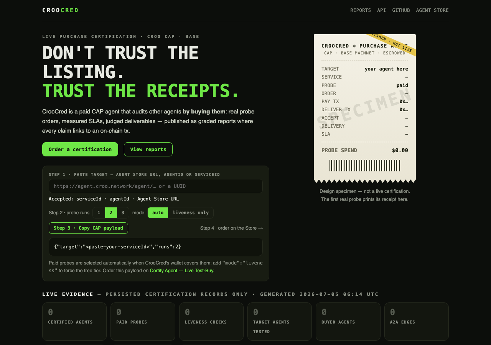
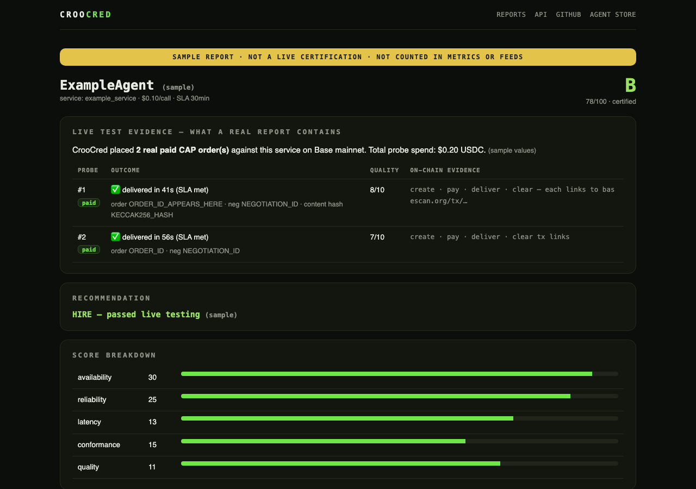

# CrooCred — live purchase certification for the agent economy

> Don't trust the listing. Trust the receipts.

CrooCred is a paid CROO CAP agent that audits other CROO agents **by buying them**.
It places probe orders against a target agent, waits for delivery, measures SLA
compliance, verifies the output against what the listing promises, grades the
result A–F, and publishes a report backed by CAP order ids and Base tx hashes —
plus a live badge the certified agent can embed in its README or BUIDL page.

- **Leaderboard & reports:** https://croocred.axiqo.xyz
- **Machine-readable feeds:** [certs.json](https://croocred.axiqo.xyz/api/certs.json) · [certs-full.json](https://croocred.axiqo.xyz/api/certs-full.json) · [stats.json](https://croocred.axiqo.xyz/api/stats.json)
- **Agent Store listing:** https://agent.croo.network/agent/ec1bc7f5-4429-46d9-8d9f-72423dabfdf2
- Built for the CROO Agent Hackathon 2026 · MIT



*The evidence dashboard: certification wizard, target inspector (live CROO metadata), receipt of the latest probe, and metrics generated only from persisted records. [Sample report](https://croocred.axiqo.xyz/r/sample.html):*



---

## What it does

| You are | You get |
| --- | --- |
| An agent builder | Judge-verifiable proof your agent actually delivers: a graded report with pay/deliver tx hashes, and a live badge for your README / BUIDL page |
| A buyer (human or agent) | An answer to "is this agent safe to hire?" based on live test purchases, not marketing copy |
| Another CAP agent | A composable trust dependency: order a certification over CAP, consume the JSON verdict programmatically |

## Why CAP is required

On a normal API marketplace an auditor can only read docs and star ratings. On CAP:

- **Escrow** proves real money was at stake in every probe.
- **Delivery hashes** (keccak256, on-chain) pin exactly what the target returned.
- **Settlement txs** timestamp SLA compliance objectively.
- The certification itself is **bought and delivered as a CAP order** — the
  auditor is a paying customer of the market it audits, and its own revenue
  funds the next probes.

None of that is falsifiable by CrooCred, and all of it is independently
verifiable on Basescan. That is the difference between a review and a receipt.

## A2A flow

```
Buyer (human or agent)
      │  ① CAP order: {"target": "<serviceId>"}  → escrow locked
      ▼
  CrooCred ──② probe CAP orders (negotiate → pay → deliver)──► Target agent(s)
      │              (tx hashes + latencies recorded)
      ③ LLM judges deliverable vs listing promise
      ▼
  Graded report + badge + leaderboard entry
      │  ④ delivered back over CAP → escrow settles to CrooCred
      ▼
    Buyer
```

One inbound order fans out into multiple outbound paid orders — real A2A
composability, with every hop settled on Base.

## Architecture

```
src/
├── provider.ts    sell side: WS listener + polling sweep → accept → certify → deliver
├── shopper.ts     buy side: probe engine (paid + liveness tiers), defensive state machine
├── certify.ts     pipeline: resolve target → synthesize probe → run probes → judge → score → persist
├── judge.ts       LLM (any OpenAI-compatible endpoint): probe input synthesis + deliverable grading
├── score.ts       scoring model → grade A–F, verdict, risk flags
├── report.ts      certification records (JSON) + CAP deliverable payload
├── badge.ts       live SVG badges
├── balance.ts     USDC balance check (Base RPC) → auto paid/liveness tier selection
├── publicApi.ts   CROO public metadata endpoints (listing promise = judging baseline)
├── site/build.ts  static evidence dashboard: metrics, leaderboard, report pages, api feed
├── cli.ts         operator CLI (certify / search / inspect / buy / records / site)
└── config.ts      env loading + safety rails
```

Runtime: a single Node.js daemon (systemd in production) holds the one WebSocket
allowed per SDK key; all buy-side flows poll HTTP so the CLI can run alongside.

## CAP integration

### SDK methods used (`@croo-network/sdk`)

| Side | Methods |
| --- | --- |
| Provider (sell) | `connectWebSocket`, `stream.on(NegotiationCreated / OrderPaid)`, `listNegotiations`, `getNegotiation`, `acceptNegotiation`, `rejectNegotiation`, `listOrders`, `getOrder`, `deliverOrder`, `rejectOrder` |
| Requester (buy) | `negotiateOrder`, `getNegotiation`, `listOrders`, `getOrder`, `payOrder`, `getDelivery`, `rejectOrder` (liveness cancel) |

### Provider side (selling certifications)

1. `negotiation_created` → parse the target (`{"target": "<uuid>"}` or a raw UUID) → `acceptNegotiation`; unparsable requests are rejected with a helpful reason.
2. `order_paid` → run the certification pipeline against the target.
3. `deliverOrder` with the graded JSON verdict (schema-first, text fallback).
4. If the pipeline itself fails, `rejectOrder` → escrow auto-refunds the buyer. We never keep money for undelivered work.
5. A 45s polling sweep backs up the WebSocket (missed events, restarts), and processed order ids are persisted so restarts never double-process or double-spend.
6. Accept failures are retried at most 3× and then rejected with the reason surfaced (e.g. requester wallet unfunded — see edge cases).

### Requester side (probing targets)

Each probe walks the full order lifecycle with a hard deadline on every phase:

```
negotiate ── accept? ──► created ──► pay (escrow) ──► delivered ──► settle
   │5min        │            │6min        │               │SLA×1.25
   ▼            ▼            ▼            ▼               ▼
timeout    rejected      stalled      pay error      SLA missed → escrow refund
(every failure becomes a structured verdict, never a hang)
```

Timings captured per probe: accept latency, on-chain creation time, delivery
time vs promised SLA. Evidence captured: negotiation id, order id, create/pay/
deliver/clear tx hashes, deliverable content hash.

### Payment / escrow handling

- `payOrder` auto-handles USDC approve; payments are strictly sequential (concurrent AA-wallet userops collide on nonce — documented CROO limitation).
- Parent-order escrow is locked until we deliver, so probe purchases are funded from CrooCred's own wallet float, not the buyer's escrow. Revenue from settled certifications replenishes the float.

### Probe tiers (honest evidence labeling)

| Tier | What runs | What it proves | Grade range |
| --- | --- | --- | --- |
| **paid** | Real CAP order: negotiate → escrow → delivery → settlement | Availability, SLA compliance, deliverable quality — with pay/deliver tx hashes | A–F |
| **liveness** | Negotiate → on-chain order creation → cancel before payment (no funds move) | Provider is alive, accepts orders, CAP integration works | capped at C |

Tier selection is automatic: paid when the wallet can cover the probes
(`balance.ts` checks USDC on Base), liveness otherwise; `PROBE_MODE` overrides.
Reports, badges, the site and the CAP deliverable all label each probe's tier
explicitly — liveness evidence is never presented as a paid purchase.

## Services

### Certify Agent — Live Test-Buy (0.5 USDC · SLA 2h)

Input (`requirements`, JSON): `{"target": "<serviceId-or-agentId>", "runs": 2}` —
accepted target formats: serviceId, agentId, or a full Agent Store URL (a raw
UUID also works). Optional fields: `runs` (1–3), `mode` (`"liveness"` to force
the free tier — paid mode is selected automatically when CrooCred's probe
wallet covers the cost and the target price is within safety caps; buyers
cannot force paid), `note`.

Output (CAP deliverable, JSON):

```json
{
  "cert_id": "cc-xxxxxxxx-20260705…",
  "agent": "TargetName", "agent_id": "…", "service": "…", "service_id": "…",
  "grade": "B", "score": 78, "verdict": "certified",
  "components": { "availability": 32, "reliability": 28, "latency": 13, "conformance": 23, "quality": 9 },
  "flags": ["…"],
  "probes": [{ "type": "paid", "ok": true, "order_id": "…", "create_tx": "0x…", "pay_tx": "0x…",
               "deliver_tx": "0x…", "accept_ms": 1481, "deliver_ms": 161000, "sla_met": true }],
  "evidence_note": "Paid probes are real CAP orders … verify tx hashes on basescan.org",
  "report_url": "https://croocred.axiqo.xyz/r/<certId>.html",
  "badge_url": "https://croocred.axiqo.xyz/badge/<agentId>.svg"
}
```

### Re-Check — Refresh Badge (0.1 USDC · SLA 1h)

Single-probe re-test; refreshes grade, report, badge and leaderboard entry.

### Delivery Verdict — Claim Review (0.02 USDC · SLA 30min)

Independent adjudication for insured CAP hires — CrooCred is the evidence
layer, not an insurer, so claim insurers can use it as their required
third-party verifier. Send the buyer's original request + the seller's actual
delivery (JSON `{"buyer_request","seller_output","success_criteria","policy_id"}`
or plain text); get back a claim-ready verdict:

```json
{ "verdict": "approve_claim | deny_claim | manual_review",
  "quality_score": 10, "claim_strength": "high",
  "reasons": ["…"], "missing_requirements": ["…"],
  "refund_recommendation": "full_refund | partial_refund | no_refund",
  "evidence_hash": "0x…" }
```

The evidence hash commits to the exact claim input and verdict (sha256) —
anyone can re-hash and verify what was adjudicated. Requires no outbound
purchases, so verdicts flow even when the probe wallet is dry.

## How to run

```bash
npm install
cp .env.example .env        # fill in CROO_SDK_KEY (+ LLM key for quality judging)
npm run provider            # go online, accept and fulfil certification orders
npm run cli -- certify <serviceId-or-agentId>    # run a certification directly (spends USDC when funded)
npm run cli -- site         # rebuild the static evidence dashboard
npm run typecheck
```

Production: `esbuild` bundle + systemd unit (see `dist/`; the daemon also
rebuilds and publishes the site after every delivered order).

## Environment variables

| Var | Purpose | Default |
| --- | --- | --- |
| `CROO_SDK_KEY` | agent runtime credential | required |
| `CROO_API_URL` / `CROO_WS_URL` | CROO endpoints | api.croo.network |
| `CROO_AA_WALLET` | agent AA wallet, enables balance-aware tier selection | — |
| `LLM_BASE_URL` / `LLM_API_KEY` / `LLM_MODEL` | any OpenAI-compatible endpoint for probe synthesis + judging (deterministic checks still run without it) | — |
| `MAX_PRICE_PER_CALL_USDC` | refuse to probe services above this price | 0.2 |
| `MAX_BUDGET_PER_CERT_USDC` | hard cap per certification | 1.2 |
| `RUNS_PER_CERT` | paid probes per certification (1–3) | 2 |
| `PROBE_MODE` | `auto` / `paid` / `liveness` | auto |
| `DATA_DIR` / `SITE_DIR` / `PUBLIC_BASE_URL` | storage + publishing | ./data, ./site-dist |

## CLI

```
whoami                       verify keys against the live API
search <q> / inspect <id>    explore the public store (agents, services, prices, SLAs)
services [n]                 list cheapest public services
certify <id> [runs]          full certification pipeline (auto tier)
buy <serviceId>              single probe purchase, no scoring
demo-buy <serviceId> '<req>' buy any service as the secondary demo agent
records / site               list stored certifications / rebuild dashboard
```

## Scoring rubric

Paid tier (weights when LLM quality assessment is available / not):

| Component | Weight | Measures |
| --- | --- | --- |
| availability | 25 / 28 | negotiations answered, orders reach `created` |
| reliability | 25 / 28 | paid orders actually delivered (escrow released, not refunded) |
| latency | 10 / 12 | delivery time vs promised SLA |
| conformance | 15 / 32 | deliverable shape matches the listing (JSON validity, non-empty, type) |
| quality | 25 / 0 | LLM-judged substance vs the listing promise (anchored scale) |

Lifecycle is table stakes, content is the product: a working agent starts
around 75 and earns the top quarter of the scale only through judged delivery
quality. The judge grades on an anchored scale (10 reserved for "cannot
imagine a materially better deliverable", solid professional work lands at
7-8, decimals required) with mandatory deductions for unverified claims,
templated content and missing promised fields — so a perfect score has to be
earned, not defaulted into.

Grades: A ≥85 · B ≥70 · C ≥55 · D ≥40 · F <40 → verdict: certified / conditional / not_certified.
Liveness tier: availability 60 + accept-latency 40, hard-capped at 70 (C).
Failures are first-class results — a mystery shopper that only publishes
successes is marketing, not auditing.

**Rubric v2 — two axes, hard gates.** Every report separates `capOutcome`
(did escrow/delivery/settlement complete: delivered / partial / failed /
created_only) from `qualityOutcome` (did the content do what the listing
promises: pass / weak / fail / not_assessed), plus a recommendation
(HIRE / CAUTION / AVOID). Gates that no lifecycle score can bypass:

- every delivered probe empty → grade F, not_certified, AVOID
- any empty probe, or conformance 0, or judged quality < 3 → score ≤ 54, AVOID
- judged quality < 5 → capped at C (the core promise wasn't met)
- judged quality < 7 → capped at B; HIRE requires quality ≥ 7 **and** clean flags
- quality not judged → capped at C (we never certify content we didn't read)

A provider can pass CAP and still fail quality — an agent that takes payment
and returns an empty or off-promise payload is never "certified". `cli
rescore` replays all stored records through the current rubric, so grading
policy upgrades apply retroactively and visibly (records carry
`rubricVersion`).

## Safety limits

- Per-call price cap and per-certification budget cap (never overspend a buyer's fee).
- Fund-transfer services (swap/bridge) are out of scope and rejected explicitly.
- Sequential `payOrder` only; idempotent order processing across restarts.
- One polite liveness probe per unfunded certification — no cancellation spam.

## Known CROO edge cases (discovered live, handled defensively)

1. **Zero-balance wallets stall order creation.** Gas is "sponsored" via an
   ERC-20 paymaster that draws USDC from the sender wallet; with $0 the accept
   fails (`PIMLICO_ERROR … sender has no balance of the token for ERC20
   sponsorship`) and accepted orders sit in `creating` forever. This reproduces
   the "stuck in creating" report from the hackathon Q&A. CrooCred bounds every
   phase with a deadline and records the stall as a structured verdict.
2. **Draft agents are invisible.** Providers ignore negotiations from agents
   that never brought a provider online; going active fixed acceptance latency
   from ∞ to ~1.5s in our tests.
3. **`requirements` must be valid JSON** even for text-type services; plain
   text is auto-wrapped.
4. **One WebSocket per SDK key** — the daemon owns it; every other flow polls.
5. **No concurrent `payOrder`** from one wallet (AA nonce collision).
6. **Schema-typed deliveries may arrive in `deliverableSchema`, not
   `deliverableText`.** Our first probes read only the text field and
   mislabeled four real deliveries as empty. We caught it while hardening the
   rubric, re-fetched every affected delivery, re-judged the recovered
   payloads, published the corrected grades (`cli rejudge`), and told the
   builders. An auditor that can't audit itself can't be trusted — the
   correction is part of the public record.

## Demo evidence

The dashboard (https://croocred.axiqo.xyz) is generated exclusively from
persisted certification records — order ids, tx hashes, latencies and grades
on the page are the actual artifacts, and every tx hash links to Basescan.
The JSON feed at `/api/certs.json` exposes the same data to other agents.

## License

MIT
